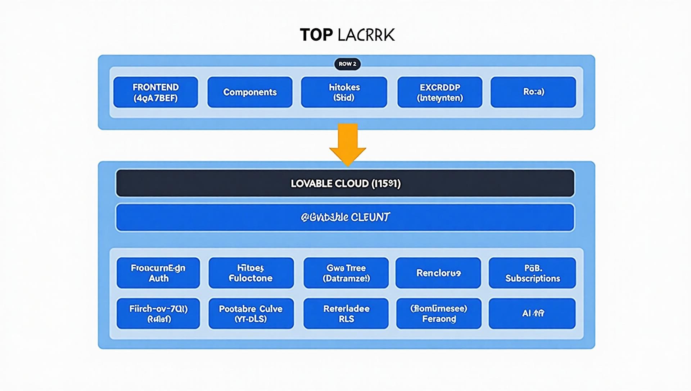

# Maslov Motors — Automotive Workshop Management System

A full-stack web application that digitizes the day-to-day operations of an auto repair shop: client self-service, workshop administration, service quoting, booking, reporting, and an AI assistant.

**Live demo:** https://maslov-motors.lovable.app

## What it does

### Client area
- Register/login with email and password (phone number required)
- Register and manage multiple vehicles (brand, model, plate, year, color, mileage)
- View full service history per vehicle
- Request quotes and book appointments with date/time slots
- Edit profile, manage cars
- Built-in AI chatbot for maintenance questions

### Admin area (back office)
- Manage clients, vehicles, and services (full CRUD)
- Quote request management and booking management
- Automatic price and margin calculation (`final_price - parts_cost`, computed in the database)
- Dashboard with revenue/costs charts, timeframes and top clients (Recharts)
- Reports generation
- Centralized admin actions (password resets, account deletion) via secure server functions

## Tech stack

| Layer | Technology |
| --- | --- |
| Frontend | React 18, TypeScript, Tailwind CSS, shadcn/ui, React Router, React Query |
| Validation | Zod (schemas shared by forms and dialogs) |
| Charts | Recharts |
| Backend | Lovable Cloud (Supabase): PostgreSQL, Auth, Row Level Security, Edge Functions (Deno) |
| AI | Gemini via the Lovable AI Gateway (SSE streaming chatbot) |

## Security highlights

- **Row Level Security (RLS)** enabled on every table — users can only reach their own data
- **Roles stored in a dedicated `user_roles` table** (never on the profile), checked through a `SECURITY DEFINER` function `has_role()` to avoid recursive policy checks
- New users always get the `client` role; only admins can change roles
- **Sensitive operations** (password change, account deletion) run server-side in authenticated Edge Functions
- Input validated on the frontend with strict **Zod** schemas

## Architecture



More diagrams: [use case](public/diagrams/diagrama-casos-uso.png) · [ER model](public/diagrams/diagrama-fluxo-eliminacao.png) · [navigation flow](public/diagrams/diagrama-navegacao.png)

## Transparency

This project was built with the help of [Lovable](https://lovable.dev) as an AI-assisted development environment. My own work covers: requirements analysis, data model design, security policies (RLS + roles), form validation, testing of flows, and architecture decisions. The academic report (in `docs/`) documents all of it.

## Running locally

```bash
# 1. Clone the repository
git clone https://github.com/danilomaslov/maslov-motors.git
cd maslov-motors

# 2. Install dependencies
npm install

# 3. Configure environment (see .env.example)
cp .env.example .env

# 4. Start the dev server
npm run dev
```

Environment variables (see `.env.example`):

- `VITE_SUPABASE_URL` — project URL
- `VITE_SUPABASE_PUBLISHABLE_KEY` — public (anon) key, safe for the frontend

> Note: only public/anon keys ever go in this file. The service role key lives exclusively in server-side Edge Function secrets.

## Scripts

| Command | Description |
| --- | --- |
| `npm run dev` | Start the development server |
| `npm run build` | Production build |
| `npm run lint` | Run ESLint |
| `npm run test` | Run unit tests (Vitest) |

## Project structure

```
src/
  components/        # UI components (dashboard client/admin, chatbot, dialogs)
  pages/             # Routes (Landing, Auth, Dashboard, legal pages)
  hooks/             # Custom hooks (useAuth, use-toast)
  integrations/      # Generated Supabase client + typed schema
  lib/               # Validation schemas (Zod), helpers
supabase/
  functions/         # Edge Functions (chat-assistant, update-password, delete-user)
docs/               # Academic reports, user manual, diagrams source
```

## Author

**Danilo Dmitrievich Maslov** — Professional Aptitude Project (PAP), Technical Course in Programming and Management of Information Systems (PGI23).
